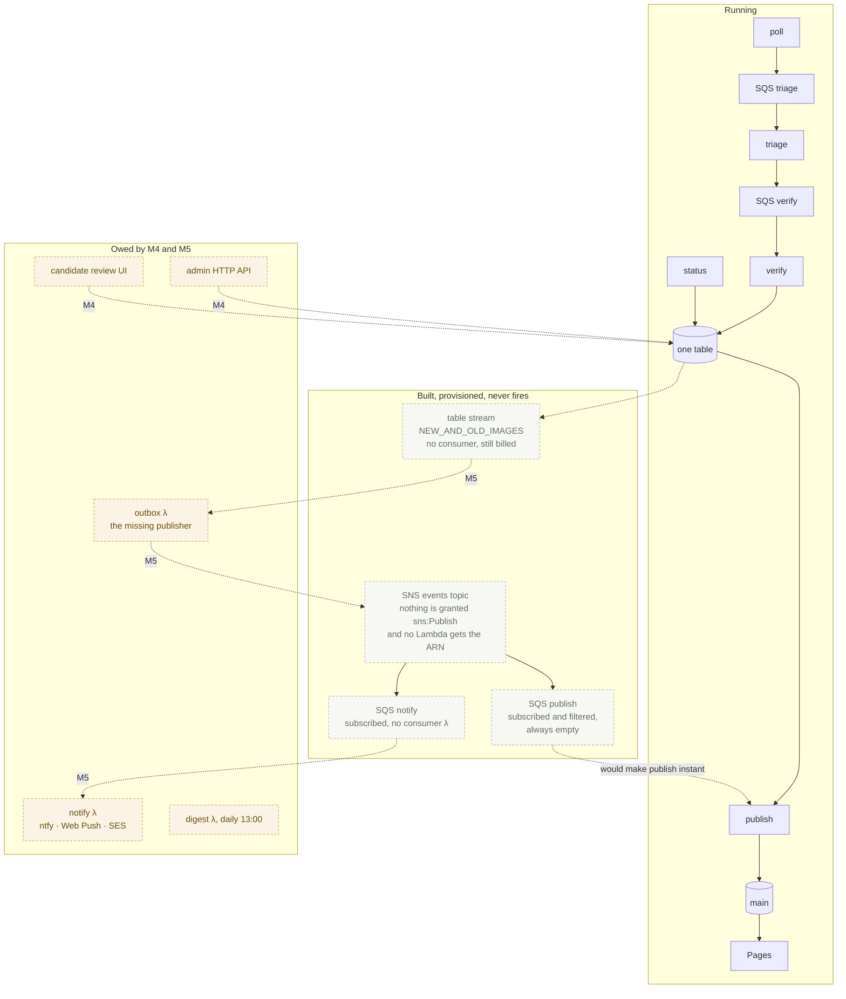
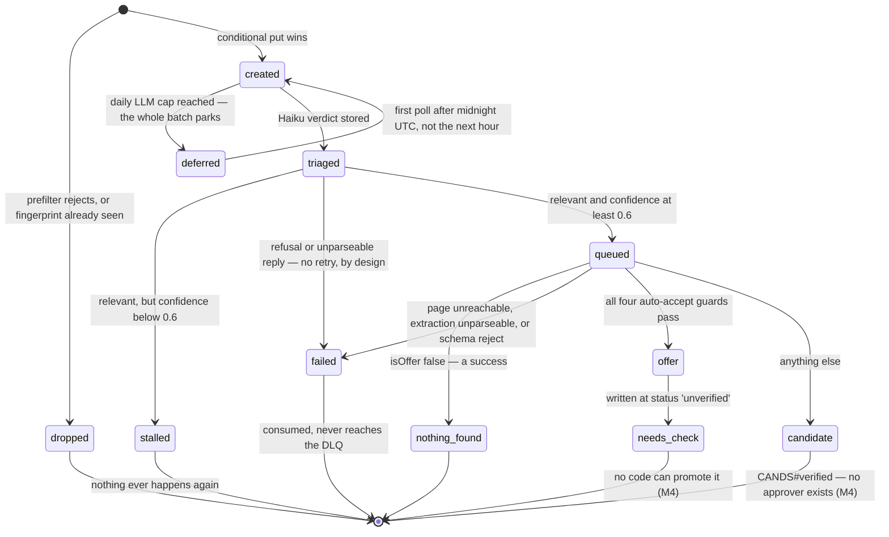
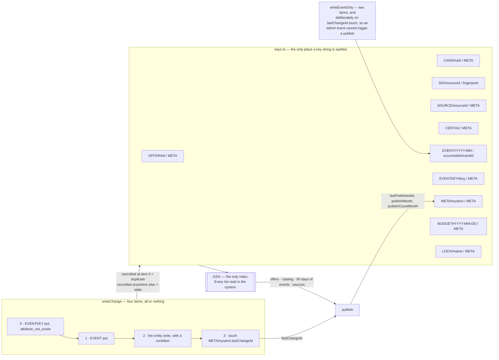
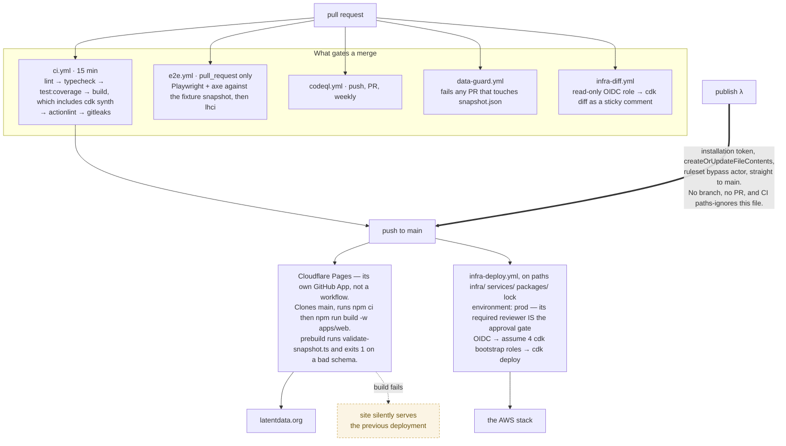

# Architecture

Five diagrams, each answering one question. They are Mermaid, so GitHub renders them inline, a
reviewer sees them change in a diff, and they paste straight into a tool like Lucidchart when you
want to draw on top of one.

Everything below describes what the code does **today**. Parts that are built but not yet wired,
and parts the milestones still owe, are drawn dashed and grey, and figure 2 is about nothing else.

## 1. The spine: a promotion on a vendor's page becomes a row on the site

```mermaid
flowchart LR
  SRC["52 sources, 47 enabled<br/>18 RSS · 23 page-diff · 9 Reddit · 2 GitHub commits<br/>each with its own pollIntervalMinutes, 60–720"]

  S1(["Scheduler<br/>cron 7 * * * ? *"])
  POLL["poll<br/>512 MB · 5 min · lease 300 s"]
  QT["SQS triage<br/>visibility 720 s · batch 10 · maxConcurrency 2"]
  TRI["triage<br/>256 MB · 2 min"]
  QV["SQS verify<br/>visibility 1080 s · batch 1 · maxConcurrency 2"]
  VER["verify<br/>512 MB · 3 min"]
  DDB[("DynamoDB, one table<br/>5+5 RCU/WCU · GSI1 3+3 · TTL expiresAt")]
  S2(["Scheduler<br/>rate 15 minutes"])
  PUB["publish<br/>256 MB · 2 min · lease 120 s"]
  S3(["Scheduler<br/>cron 17 4 * * ? *"])
  STAT["status<br/>512 MB · 10 min · lease 600 s"]
  HAIKU["claude-haiku-4-5"]
  SONNET["claude-sonnet-5-5"]
  MAIN[("GitHub main<br/>apps/web/src/data/snapshot.json")]
  SITE["Cloudflare Pages<br/>latentdata.org"]
  HUMAN["a person<br/>no code can do this yet"]

  S1 -->|"hourly at :07"| POLL
  POLL -->|"only sources that are due,<br/>4 at a time, 15 s each"| SRC
  SRC -->|"items"| POLL
  POLL -->|"22 include / 11 exclude keywords,<br/>then conditional put SIGNAL"| DDB
  POLL -->|"only rows the put created"| QT
  QT --> TRI
  TRI -->|"one batched call for up to 10"| HAIKU
  HAIKU --> TRI
  TRI -->|"verdict"| DDB
  TRI -->|"relevant AND confidence ≥ 0.6"| QV
  QV --> VER
  VER -->|"the page plus up to 2 links,<br/>capped at 12 000 chars"| SRC
  VER -->|"extract, maybe search, maybe extract again"| SONNET
  SONNET --> VER
  VER -->|"OFFER at status 'unverified',<br/>or a CANDIDATE nobody can approve"| DDB
  S3 -->|"daily 04:17 UTC"| STAT
  STAT -->|"expiry, expiring-soon, liveness"| DDB
  S2 --> PUB
  DDB -->|"is lastChangeAt newer<br/>than lastPublishedAt?"| PUB
  PUB -->|"GitHub App commit,<br/>at most 200 a month"| MAIN
  MAIN -->|"push triggers a build"| SITE
  HUMAN -.->|"promote 'unverified' → 'active'.<br/>The admin API is M4."| DDB

  classDef planned fill:#f7f8f4,stroke:#aab3a6,color:#657165,stroke-dasharray:4 3
  class HUMAN planned
```

Two numbers decide how fresh the site is, and neither is the hourly schedule. A source is polled
on **its own** interval — 60 to 720 minutes — so the gap between a promotion appearing and a
signal existing is one to twelve hours. After that, publish sweeps every fifteen minutes. There
is no faster path: see figure 2.

The dashed arrow is the honest part. `verify` can only ever write an offer at status
`unverified`, and `status` deliberately never promotes it — it moves `active`/`upcoming` to
`expired` and `upcoming` to `active`, nothing else. The site shows such an offer in its "check"
group, labelled as needing a manual look. Nothing in the deployed system can clear that.

## 2. What is running, what is idle, and what is only drawn

The events topic has **no publisher anywhere in the repository**. Events are written as DynamoDB
items by `lib/repo/events.ts`; nothing forwards them to SNS, because the stream consumer that
would is M5. So both subscriptions are wired and dead, the publish queue is permanently empty,
and `isUrgent()` in `publish.ts` is never true. Every commit comes from the fifteen-minute sweep.

The notify queue has no consumer at all — there are exactly five Lambdas and three event source
mappings. The table stream is enabled with no `grantStreamRead` anywhere: idle, and billable.

## 3. One signal's journey

The four auto-accept guards, all of which must pass: confidence is `high`, no existing offer
matched, the source URL is on a known vendor domain for that vendor, and the computed slug is
free. Even then the offer lands as `unverified`, `addedBy: 'scan'`, with a note saying no person
has checked it.

Three exits are silent. A sub-0.6 verdict is stored and forgotten with no metric. A parse failure
is dropped loudly in logs but never returned as a batch item failure, so it never reaches the DLQ
and never trips the alarm. And a run that cannot take its lease returns `ran: false` with no
error and no metric — a skipped run looks exactly like a healthy one.

## 4. One table, one index, one transaction

Publishing is driven entirely by two fields on one item. `publish` returns `unchanged` when
`lastChangeAt` is null or not newer than `lastPublishedAt`, `rate-limited` inside the fifteen
minute window, and `capped` at 200 commits in the current `publishMonth`. The snapshot is then
rebuilt from four GSI1 queries and byte-compared with what GitHub already holds — with
`generatedAt`, `lastPollAt` and `lastStatusRunAt` blanked first, so a snapshot that differs only
in run timestamps never costs a commit or a Cloudflare build.

`LOCK#<name>` is a lease, not a mutex: `attribute_not_exists(PK) OR expiresAt < :now`, released
only by the holder that took it. Three exist — poll 300 s, status 600 s, publish 120 s — each
equal to its Lambda's timeout, so a run that uses its whole budget loses the lease exactly as it
dies.

## 5. Two deploy paths, and one commit that skips both

Nothing in GitHub Actions runs on the publisher's own commits: `ci.yml` and `codeql.yml`
`paths-ignore` the snapshot, `e2e.yml` is pull_request-only, and `data-guard.yml` triggers only on
pull requests. The single remaining gate is `validate-snapshot.ts` in apps/web's `prebuild`, run
inside the Cloudflare build. If it fails, the Pages build fails and the site keeps serving the
previous deployment — and no alarm, topic or metric in AWS observes that. `publish` has already
recorded `committed` and incremented the monthly counter.

`data-guard.yml` exists because there is a second writer to that file: `npm run snapshot:local`
rewrites it from the seed for local development. The guard is what stops that reaching `main`.

## Rules the code holds itself to

- **The database is the truth, the snapshot is a view.** Nothing reads the snapshot back as data.
  `publish` opens it only to get the current sha and to compare content.
- **Status is derived, not stored.** `deriveStatus()` in `packages/core` decides from the dates;
  the stored status is a hint for the undated cases and an index key.
- **The catalog's join is computed too.** `catalogMatch()` pairs a credential with the offers that
  cover it, in the browser, on every render. Nothing records that an offer covers a credential, so a
  new offer needs no migration to light one up and a wrong match is one publish away from fixed.
- **Every write that must not repeat carries an idempotency key** and a condition expression.
  Every Lambda invocation is assumed to be retried.
- **Every external call goes through an adapter** with a timeout, bounded retries with jitter
  and a typed error. Nothing retries forever. One request per second per host, serialised.
- **Everything that can cost money fails closed.** Provisioned capacity with no autoscaling, a
  $1/day LLM cap, a 200-commit month, two budgets, ten metric names, and an alarm on each guard.

## What exists today

| Piece                                          | State                                               |
| ---------------------------------------------- | --------------------------------------------------- |
| Static site, snapshot validation               | live                                                |
| Table, events topic, queues, shared DLQ        | live (topic and 2 queues idle — figure 2)           |
| `publish`, `status`                            | live                                                |
| `poll`, `triage`, `verify`                     | live                                                |
| Credential catalog, audience lens              | live                                                |
| Admin sign-in, approve and dismiss a candidate | M4 — built (ADR-0014); the figures above predate it |
| Promote `unverified`, merge, source health     | later — no code path yet                            |
| `outbox`, `notify`, `digest`                   | M5 — the topic has no publisher until `outbox`      |

Decisions and their reasons are in [adr/](adr/).
